# Hybrid Covariance Steering

Implementation of **Hybrid Covariance Steering** for stochastic hybrid dynamical systems, based on the paper:

Paper: [Hybrid Covariance Steering - arXiv:2410.13222](https://arxiv.org/pdf/2410.13222)

This repository provides methods for steering both the mean trajectory and uncertainty (covariance) of hybrid systems that exhibit discrete mode transitions alongside continuous dynamics.

## Overview

Hybrid covariance steering addresses the problem of controlling stochastic systems with **hybrid dynamics** (continuous flow + discrete jumps) to achieve desired distributions at specified times. Unlike standard LQG control, this method:

- Explicitly steers covariance through mode transitions
- Handles saltation matrices at discrete events
- Provides optimal feedback control for both mean and uncertainty
- Uses convex optimization for computational efficiency

## Theory Summary

### Problem Formulation
For a linear stochastic system with hybrid transitions at time t*:

**Mode 1 (pre-jump):** `dX₁ = A₁X₁dt + B₁(u₁dt + √ε dW₁)`  
**Jump dynamics:** `X₂(t⁺) = Ξ X₁(t⁻)` (Saltation Matrix)  
**Mode 2 (post-jump):** `dX₂ = A₂X₂dt + B₂(u₂dt + √ε dW₂)`

**Objective:** Minimize control energy while steering covariances `Σ₀ → ΣT`

### Key Components

**Saltation Matrix (Ξ):** Linear approximation of nonlinear jump dynamics accounting for impact timing and state variation:
```
Ξ = ∂ₓR + [(Fₖ - ∂ₓR·Fⱼ - ∂ₜR)∂ₓg] / [∂ₜg + ∂ₓg·Fⱼ]
```

**Covariance Evolution:**
- Smooth flow: `dΣ/dt = AclΣ + ΣAcl' + εBB'` (Lyapunov equation)
- At jump: `Σ₂(t⁺) = Ξ Σ₁(t⁻) Ξ'` (covariance propagation)

**Riccati Coupling:** Feedback gain `K(t) = -B'Π(t)` where Π satisfies:
- Smooth Riccati: `-dΠ/dt = A'Π + ΠA - ΠBB'Π + Q`
- Jump condition: `Ξ'Π₂(t⁺)Ξ = Π₁(t⁻)` (for invertible Ξ)

### Solution Methods

**1. Closed-Form Solution (Invertible Ξ):**  
When jump dynamics are invertible, analytical solution via hybrid transition kernel Φᴴ preserving symplectic structure.

**2. Convex SDP (General Ξ):**  
For singular/rectangular jumps, reformulate as Semi-Definite Program:
```
min trace(S₁⁻¹Σ⁻) + trace(Φ₂'S₂⁻¹Φ₂Σ⁺) - log det(Y₁) - log det(Y₂)
s.t. Σ⁺ = Ξ Σ⁻ Ξ'  (saltation constraint)
     [Σ⁺  W₂']
     [W₂  ΣT-Y₂] ⪰ 0
```

**Connection to Schrödinger Bridge:** The problem is equivalent to minimizing KL divergence between controlled path measure and uncontrolled reference, reducing infinite-dimensional problem to finite-dimensional covariance optimization.

## System Examples

The repository includes implementations for several hybrid systems:

### 1. **Bouncing Ball** (`h_cs_bouncing.py`, `h_cs_2Dbouncing_optimization.py`)
- 2D point mass with gravity and elastic ground collisions
- State: position and velocity `[z, ż]`
- Mode transition: ground contact with coefficient of restitution

### 2. **SLIP Model** (`h_cs_slip.py`, `h_cs_slip_landing.py`)
- Spring-Loaded Inverted Pendulum for legged locomotion
- Two modes: flight (5D) and stance (4D)
- Demonstrates running and landing behaviors

## Key Features

### Convex Optimization Formulation
Solves for optimal covariances `Σ⁻` (pre-jump) and `Σ⁺` (post-jump) via:
```python
minimize: trace(S₁⁻¹Σ⁻) + trace(Φ₂ᵀS₂⁻¹Φ₂Σ⁺) - log det(Y₁) - log det(Y₂)
subject to: Σ⁺ = E Σ⁻ Eᵀ  (saltation constraint)
           Matrix SDPs for initial/terminal constraints
```

### Riccati-Based Feedback Synthesis
Computes time-varying feedback gains `K(t)` by:
1. Solving matrix Hamiltonian ODEs in each mode
2. Integrating forward [0, t⁻] and backward [t⁺, T]
3. Handling jump conditions with proper boundary values

### Comparison with H-iLQR
All examples compare against Hybrid iLQR baseline, showing improved covariance regulation.

## Installation

### Requirements
```bash
pip install numpy scipy matplotlib cvxpy jax
```

### Dependencies
- **NumPy/SciPy**: Numerical computation and ODE integration
- **CVXPY**: Convex optimization for covariance targets
- **JAX**: Automatic differentiation for Jacobians
- **Matplotlib**: Visualization

## Usage

### Running Bouncing Ball Example
```bash
python h_cs_bouncing.py
```

This will:
1. Solve H-iLQR for nominal trajectory
2. Compute optimal pre/post-jump covariances via convex optimization
3. Synthesize covariance steering controller
4. Generate comparison plots (saved as PDFs)

### Running SLIP Example
```bash
python h_cs_slip.py  # Running motion
python h_cs_slip_landing.py  # Landing from flight
```

### Visualization (MATLAB)
```matlab
% Load and plot covariance tube
run plot_cov_trj_bouncing.m
```
Creates 3D surface plot showing covariance evolution along mean trajectory.

## Example Results

### Bouncing Ball with Elastic Impact


The bouncing ball example demonstrates covariance steering through elastic collisions. The visualization shows:
- **3-sigma covariance ellipses** along the trajectory (plotted every 10-40 timesteps)
- **Initial covariance** (red) and **terminal covariance** (green)
- **Pre-jump covariance Σ⁻** (black) and **post-jump covariance Σ⁺** (cyan)
- **Comparison:** H-CS explicitly optimizes jump covariances vs H-iLQR standard LQG approach

The H-CS controller successfully steers the state covariance to the exact target `ΣT = 0.05I₂` despite stochastic impact timing.

> **Note:** If viewing on GitHub and figures don't display, you can convert PDFs to PNG: `convert -density 300 figures/cov_steering_bouncing.pdf figures/cov_steering_bouncing.png`

### SLIP Model with State Dimension Change

The Spring-Loaded Inverted Pendulum (SLIP) example shows covariance steering with **singular jump dynamics** (4D stance → 5D flight):
- **Nominal trajectory** (transparent legs with springs) computed via H-iLQR
- **Stochastic samples** (cyan dots) starting from initial distribution (red diamonds)
- **3-sigma terminal boundary** showing target covariance achieved
- **Mode transition:** System jumps from lower to higher dimensional state space

The convex SDP formulation handles the singular post-jump covariance `Σ⁺`, which is rank-deficient due to dimension increase. Monte Carlo samples validate that the controller achieves the specified terminal covariance `ΣT = 0.0003I₅`.

### 1. Solve for the Mean trajectory using H-iLQR

The Spring-Loaded Inverted Pendulum (SLIP) example shows covariance steering with **singular jump dynamics** (4D stance → 5D flight):
- **Nominal trajectory** (transparent legs with springs) computed via H-iLQR
- **Stochastic samples** (cyan dots) starting from initial distribution (red diamonds)
- **3-sigma terminal boundary** showing target covariance achieved
- **Mode transition:** System jumps from lower to higher dimensional state space

The convex SDP formulation handles the singular post-jump covariance `Σ⁺`, which is rank-deficient due to dimension increase. Monte Carlo samples validate that the controller achieves the specified terminal covariance `ΣT = 0.0003I₅`.

### 1. Solve for the Mean trajectory using H-iLQR

#### Initial guess:

<p style="text-align:center;">
<p style="text-align:center;">
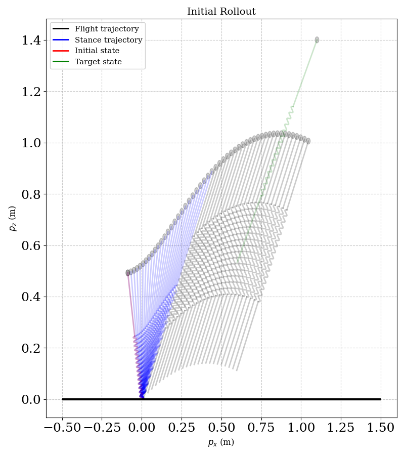
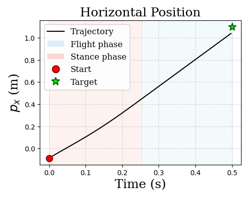
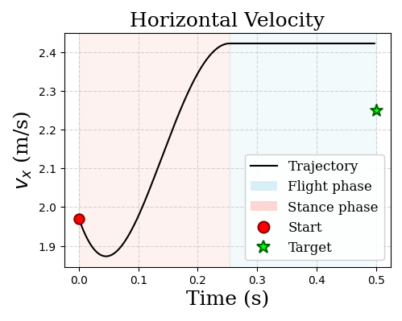
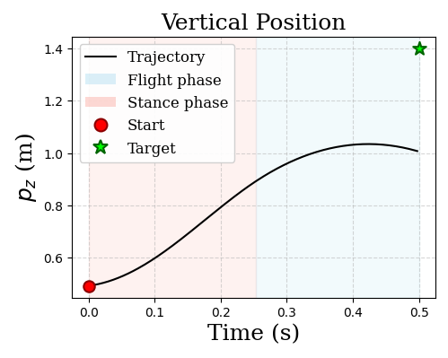
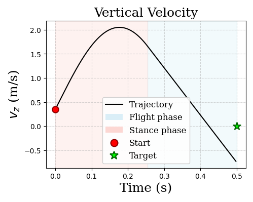
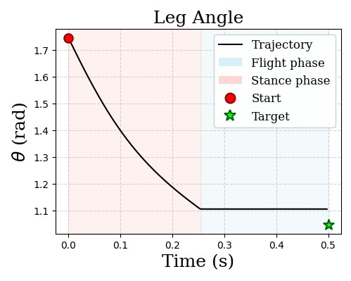
</p>
</p>

#### After H-iLQR optimization:

<p style="text-align:center;">

<p style="text-align:center;">
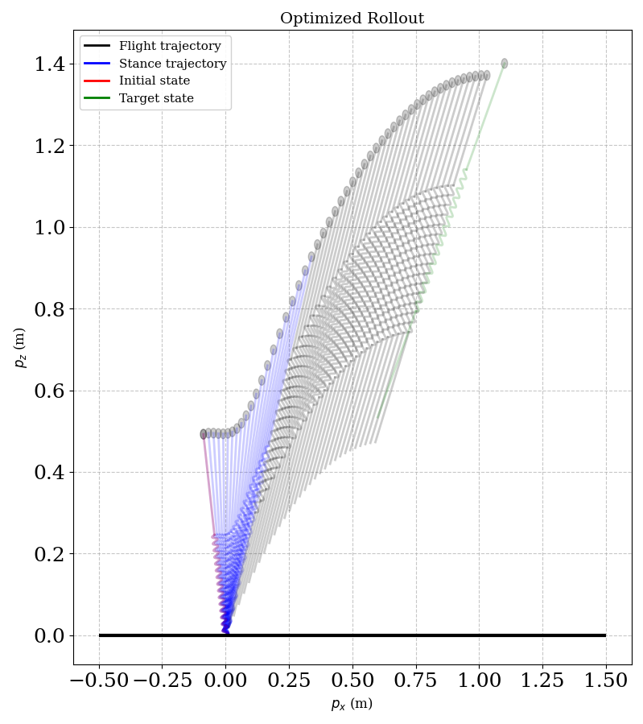
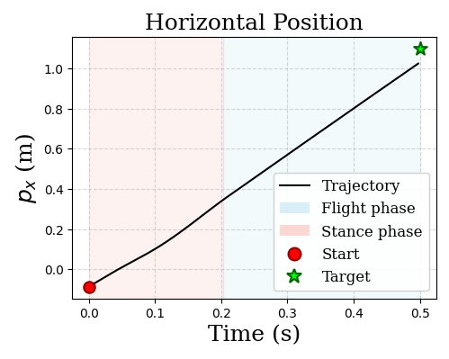
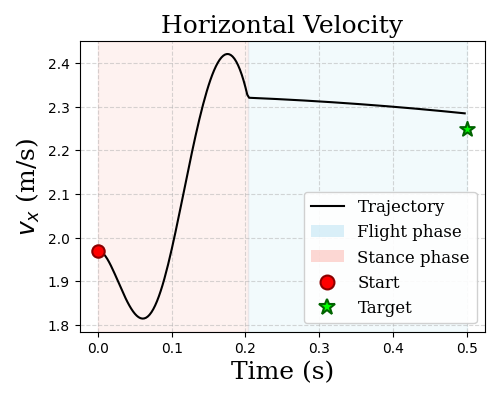
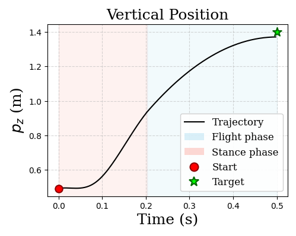
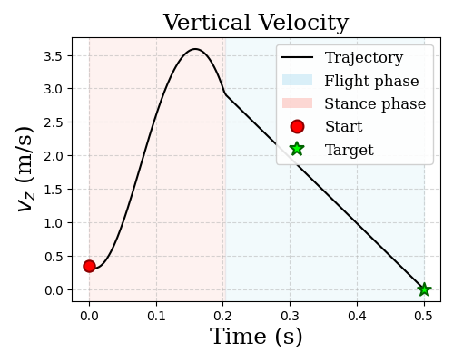
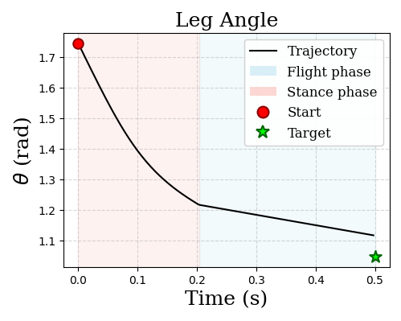
</p>

### 2. Solve for the Covariance Control Problem

<p style="text-align:center;">


</p>

</p>

### 2. Solve for the Covariance Control Problem

<p style="text-align:center;">


</p>


## Project Structure

```
.
├── h_cs_bouncing.py                  # Bouncing ball with closed-form solution
├── h_cs_2Dbouncing_optimization.py   # Bouncing ball with separate optimization
├── h_cs_bouncing_optimization_saparate.py
├── h_cs_slip.py                      # SLIP running example
├── h_cs_slip_landing.py              # SLIP landing example  
├── h_cs_3link.py                     # 3-link walker
├── plot_cov_trj.m                    # MATLAB 3D covariance visualization
├── plot_cov_trj_bouncing.m           # MATLAB bouncing ball plotter
├── test_cvx.py                       # CVXPY solver verification
├── cov_steering_bouncing.eps         # Sample result figure
└── figures/                          # Output visualizations
    ├── cov_steering_bouncing.pdf
    ├── h_cs_slip_samples.pdf
    └── ...
```

## Algorithm Overview

For a hybrid system with event time `t*`:

### Phase 1: Optimization (`obj_1 + obj_2`)
- Compute state transition matrices `Φ₁`, `Φ₂` and controllability Gramians `S₁`, `S₂`
- Solve convex program for optimal `Σ⁻` and `Σ⁺`
- Ensures saltation jump: `Σ⁺ = E Σ⁻ Eᵀ`

### Phase 2: Controller Synthesis
- **[0, t⁻]**: Forward integrate Hamiltonian system with boundary `Π₀`
- **[t⁺, T]**: Backward integrate from terminal boundary `ΠT`  
- Compute feedback: `K(t) = -B(t)ᵀΠ(t)`

### Phase 3: Rollout
- Closed-loop simulation with process noise
- Covariance propagation: `dΣ/dt = AclΣ + ΣAclᵀ + εBBᵀ`
- Mode transitions via guard conditions

## Citation

If you use this code, please cite:

```bibtex
@article{yu2024optimal,
  title={Optimal covariance steering of linear stochastic systems with hybrid transitions},
  author={Yu, Hongzhe and Franco, Diana Frias and Johnson, Aaron M and Chen, Yongxin},
  journal={arXiv preprint arXiv:2410.13222},
  year={2024}
}

```

## Related Work

This implementation builds upon:
- **Hybrid iLQR**: Trajectory optimization for hybrid systems
- **Covariance Steering**: Exact uncertainty control for linear systems
- **Path Integral Control**: Stochastic optimal control methods

## License

MIT.

**Last Updated**: December 2025
**Last Updated**: December 2025
